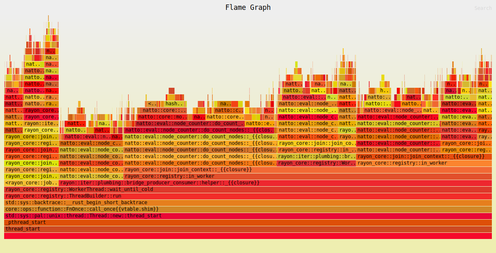
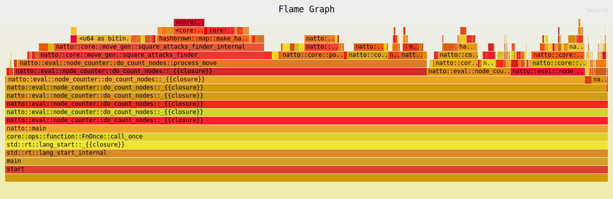

# Performance of Copy/Make Move vs Make Move / Unmake Move
A look at the performance of the copy / make move technique of applying a move to the board
vs the make move / unmake move technique.

---

## Overview
To facilitate the integration of a neural engine (NNUE) the copy / make move technique was
updated to use make move / unmake move.. 

---

## Changes Made
An unmake move function was added so that the same board instance is used throughout
the game tree.

---
## Performance Analysis
The performance of the perft test was measured using the flamegraph tool. 

Below is a sample flamegraph generated using the copy / make move version:

This was produced using the perft command line option. The following output was 
produced:

Running perft test  
Depth 0 nodes 1 nps 0  
Depth 1 nodes 20 nps 2910  
Depth 2 nodes 400 nps 2352941  
Depth 3 nodes 8902 nps 15037162  
Depth 4 nodes 197281 nps 38351671  
Depth 5 nodes 4865609 nps 44445338  
Depth 6 nodes 119060324 nps 48744253  

The same procedure was then used to test the new make move / unmake move version:

Running perft test
Depth 0 nodes 1 nps 0
Depth 1 nodes 20 nps 3212
Depth 2 nodes 400 nps 5970149
Depth 3 nodes 8902 nps 5139722
Depth 4 nodes 197281 nps 7351356
Depth 5 nodes 4865609 nps 10365790
Depth 6 nodes 119060324 nps 10257354

---
## Conclusion
The changes more than doubled the performance of the perft test.
