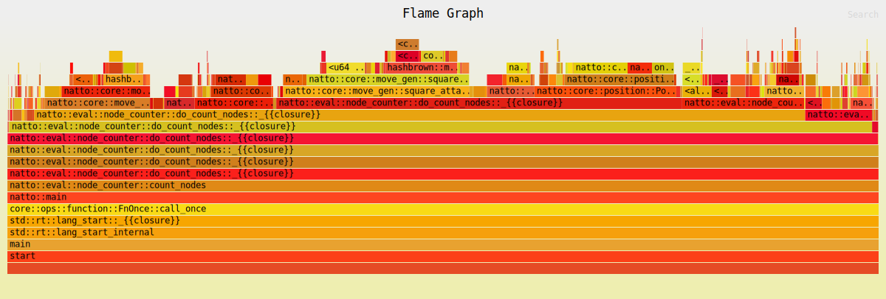

# Performance of Hashmaps vs Vectors in Move Table Lookup

Flamegraphs generated from perft tests indicated that the move generator's hashmap lookups of various move tables 
by piece type were a bottleneck. 
---

## Overview

The move generator makes extensive use of tables to speed up move generation. These tables are stored in various 
hashmaps that are keyed by the piece type. The hashmap lookup is a bottleneck in move generation.

All tests were performed on an Mac mini M4 using a single thread.

## Optimizations Made
The hashmaps were changed to vectors. Lookups now index into the vector using each piece type's pre-existing unique zero
based index. This eliminates the need to perform a hashmap lookup.

---
## Improvements

Below is a sample flamegraph generated during the initial profiling:

This was produced using the perft command line option. Here's the output produced on a normal run:

Running perft test
Depth 0 nodes 1 nps 0
Depth 1 nodes 20 nps 3688
Depth 2 nodes 400 nps 5333333
Depth 3 nodes 8902 nps 4283926
Depth 4 nodes 197281 nps 5460007
Depth 5 nodes 4865609 nps 6585978
Depth 6 nodes 119060324 nps 7127481

After the changes the test was repeated and produced this flamegraph and output:

Running perft test
Depth 0 nodes 1 nps 0
Depth 1 nodes 20 nps 5411
Depth 2 nodes 400 nps 5882352
Depth 3 nodes 8902 nps 7654342
Depth 4 nodes 197281 nps 9481928
Depth 5 nodes 4865609 nps 13401075
Depth 6 nodes 119060324 nps 13467803

## Conclusion
The changes almost doubled the performance of the perft test.

